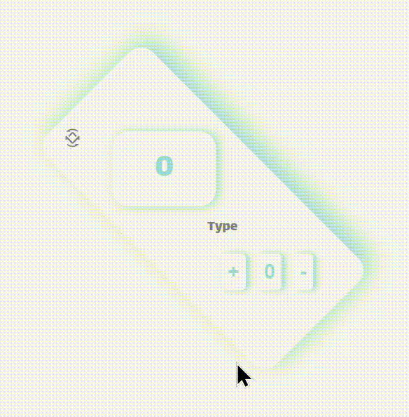

# <p align="center"> Hi there 👋 I'm Mohammad Hossein 👨‍💻 </p>
 <p align="center"> React Js expert and FrontEnd Developer from Iran.</p>

## Description Project
- A beautiful counter with the ability to rotate the main container box to 45 degree angles

- This counter may be very simple and unusable، but the main purpose of this counter is to create a counter behind the backdrop of react، which wants to show the use of callback here، or somehow show one of its uses in this mini-project.

>### Languages
>> 
>>
>> 
>> 
>> 
>> 
>> 

>### Packages
>> 

## View of the project



## Getting Started

Before running the project, it is necessary to install npm on your system, then you can put the following command in the path of the project

and after installing the related packages run the project.

```
> npm install
```
OR
```
> npm i
```

Then, after you finish installing the packages, run this command to start your React program.

```
> npm start
```

### `npm start`

Runs the app in the development mode.\
Open [http://localhost:3000](http://localhost:3000) to view it in your browser.

The page will reload when you make changes.\
You may also see any lint errors in the console.

### Guid
If you are not installed on your system Node.js and Npm, go to this [Link Install](https://nodejs.org/en/download) and install and then proceed to the above steps

Install Node.js and NPM in Windows via Node.js Installer

___
>### Social Network
> [](https://github.com/khadem-mh)
> [](https://pinterest.com/khadem_mh)
> [](https://t.me/mhkhadem)
> [](https://wa.me/989031335939)
> [](https://wakatime.com/@khadem_mh)
